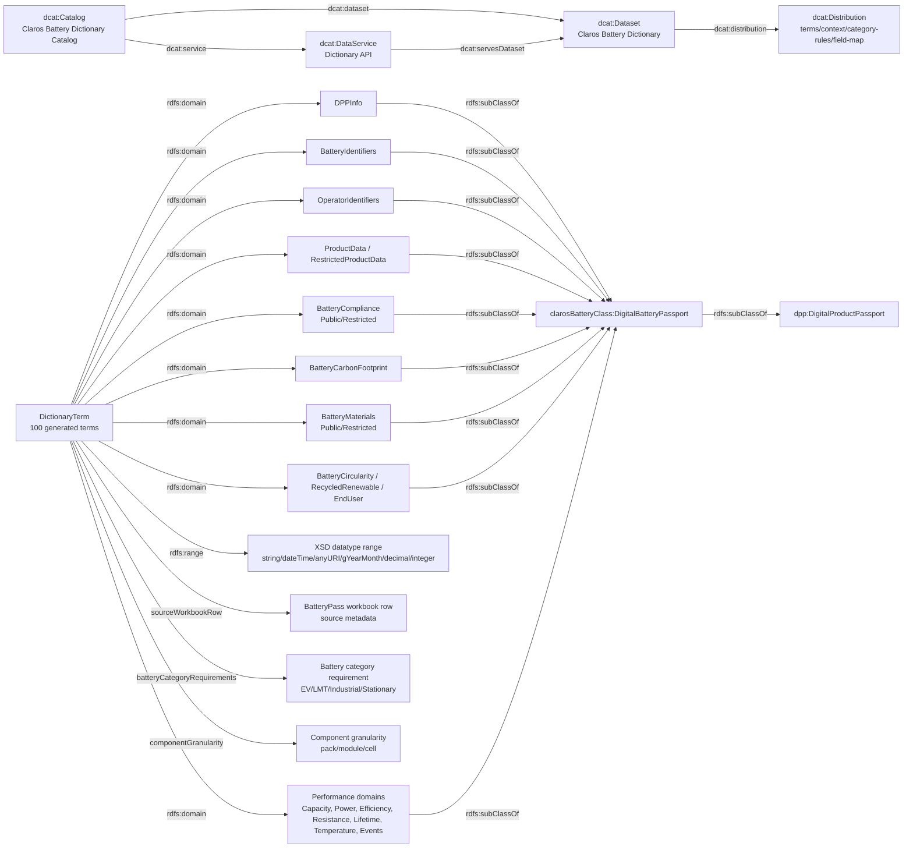

# Battery Dictionary Ontology Diagram

Last updated: 2026-05-05

This diagram shows the current semantic model at a compact level. It is not a full expansion of all 100 battery dictionary terms; those live in `apps/backend-api/resources/semantics/battery/v1/terms.json`.

WebVOWL-style source:
- `docs/architecture/battery-dictionary-webvowl.json`

## DCAT/DCAT-AP Status

Current status: DCAT/DCAT-AP-aligned, not yet a fully validated DCAT-AP publication.

Implemented:
- `catalog.jsonld` with `dcat:Catalog`, `dcat:Dataset`, `dcat:Distribution`, `dcat:DataService`, and `dcat:CatalogRecord`.
- DCAT 3 and DCAT-AP 3.0.1 conformance links.
- JSON-LD context with protected terms, `id`/`type` aliases, and `DigitalBatteryPassport`.
- Explicit term-level `domain` and `range`.
- Spherity v0.2-style section domains, for example `DPPInfo`, `BatteryIdentifiers`, `BatteryCarbonFootprint`, `CapacityEnergyVoltagePublic`, and `TemperatureConditionsRestricted`, instead of one generic `DictionaryTerm` domain.
- Workbook-derived traceability for all 100 terms.

Still missing for a stronger/full DCAT-AP implementation:
- Run the generated catalog through a DCAT-AP 3.0.1 SHACL validator and check every mandatory/recommended property.
- Add formal license/rights metadata, for example `dcterms:license` and stronger `dcterms:accessRights` at dataset/distribution level.
- Add content negotiation for canonical IRIs so `/dictionary/battery/v1`, `/dataset`, `/catalog`, and term IRIs can serve HTML or RDF/JSON-LD depending on `Accept`.
- Publish a formal ontology file in RDF/Turtle or JSON-LD beyond the compact JSON artifacts.
- Add SHACL shapes for term values, required fields by battery category, and enumerations/code lists.
- Add persistent human-readable pages for every term IRI, not only API JSON responses.
- Add version history/change records using `adms:versionNotes`, `owl:versionInfo`, or catalog records per release.
